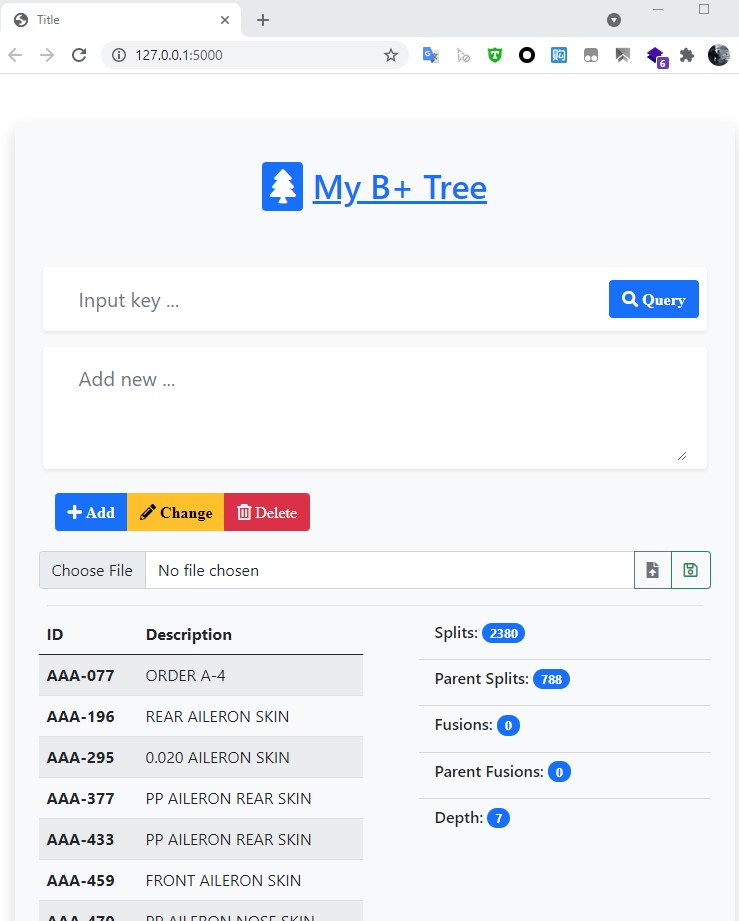

# Python-B-tree
This project consists of two parts:  B+-tree for storing parts data and a user interface for accessing the data.  
It would read example data in partfile.txt on load

### Dependency
flask, bootstrap, IDE:pycharm
